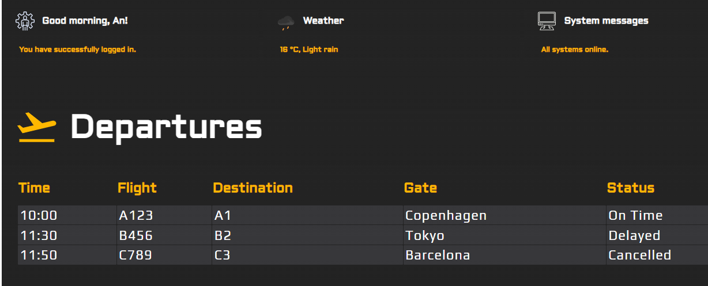

# Dashboard Flights



## Getting Started

1. Clone the repository:

   ```bash
   git clone https://github.com/yourusername/yourproject.git
   cd yourproject
   ```

2. Install necessary dependencies:

   ```bash
   npm install
   ```

3. Create a `.env.local` file by copying the provided `.env.example` file in the root directory:

   ```bash
   cp .env.example .env.local
   ```

4. Run the development server:

   ```bash
   npm run dev
   ```

Now you can open [http://localhost:3000](http://localhost:3000) to view it in the browser.

## Documentation

- [Developer Guidelines](documentation/Developer-Guidelines.md)
- [Frontend Architecture](documentation/Frontend-Architecture.md)
- [Configurations](documentation/Configurations.md)
- [API Endpoints](documentation/API-Endpoints.md)
- [UX Guidelines](documentation/UX-Guidelines.md)
- [Error Handling](documentation/Error-Handling.md)
- [JavaScript Security](documentation/JavaScript-Security)
- [Dockerize](documentation/Dockerize)
