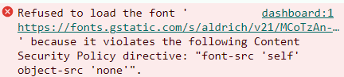

# Security

## Avoiding JavaScript Attack Vectors

### Cross-Site Script Injections

This application includes a text area for embedding YouTube videos. To render the embedded code, `dangerouslySetInnerHTML` is used, allowing users to paste HTML directly into the interface. However, without sanitizing the input with `DOMPurify`, it is possible to inject malicious JavaScript code. For example:

```html
<button onclick="alert('123')">Click here</button>

<p onmouseover="alert('123')">Read this</p>

<p><a href="javascript:alert('Injected via a href')">More on this</a></p>
```

## Installing DomPurify

DomPurify is installed along with its TypeScript definitions:

```
npm install dompurify
npm install --save-dev @types/dompurify@^3.0.5
```

## Configuring DOMPurify to Allow YouTube iframes

To safely embed YouTube iframes while preventing cross-site scripting (XSS) attacks, I have configured DOMPurify with a specific set of allowed tags and attributes. Below is the configuration example:

```javascript
const sanitizerConfig = {
  ALLOWED_TAGS: ['iframe'],
  ALLOWED_ATTR: [
    'src',
    'width',
    'height',
    'frameborder',
    'allow',
    'allowfullscreen',
    'title',
    'referrerpolicy',
  ],
  ALLOWED_URI_REGEXP: /^(https:\/\/www\.youtube\.com\/embed\/[a-zA-Z0-9_-]+\?.*)$/,
};
```

## Content Security Policy

The Content Security Policy (CSP) directives are configured to enhance security and allow specific external resources. Below is a snippet of configuration:

```
style-src 'self' 'unsafe-inline' https://fonts.googleapis.com;
img-src 'self' blob: data:;
font-src 'self' https://fonts.gstatic.com;
```

### Directives Explained

- **`style-src 'self' 'unsafe-inline' https://fonts.googleapis.com`**:

  - **'self'**: Allows styles from the same origin.
  - **'unsafe-inline'**: Allows inline styles (necessary for some use cases but can be a security risk).
  - **`https://fonts.googleapis.com`**: Allows stylesheets to be loaded from Google Fonts.

- **`font-src 'self' https://fonts.gstatic.com`**:
  - **'self'**: Allows fonts from the same origin.
  - **`https://fonts.gstatic.com`**: Allows fonts to be loaded from Google Fonts.

Whenever you use external sources, please configure the directives to allow the specific sources being used.


