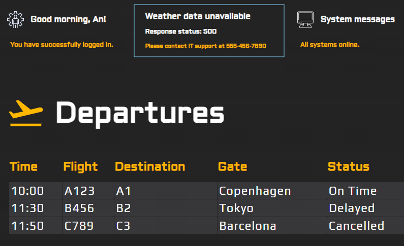

# User Experience (UX) Guidelines

## Graceful Degradation Guide

### Fallback Mechanism

- Display relevant alternative content for failed data fetches.
- Provide context to users about missing data.

Example:

### Visual Integrity

- Ensure the dashboard's visual presentation remains intact if data cannot be displayed.
- 
Avoid empty or broken components that could confuse users.

- Use spinners to indicate loading.

### Tokens

- Use tokens for sizing, spacing and colors. (To be found in global.css)
